Predicting Demand for Bicycles
================
Chase Baggett, Carlo Mazzoleni, Yanxiang Shi
April 29, 2018

Introduction
============

In this project, we developed models to predict the total bike renting count by hour, using the data provided by the "Bike Sharing Demand" from Kaggle (<https://www.kaggle.com/c/bike-sharing-demand/data>). We explored models based on decision tree and regression, and selected the best model based on Root Mean Squared Logarithmic Error (RMSLE) value obtained using cross validation.

Data
====

The data provided by the Kaggle "Bike Sharing Demand" contains two parts: a training dataset and test dataset. According to the project description, those data covers hourly bike renting information throughout two years. The training dataset "is comprised of the first 19 days of each month, while the test set is the 20th to the end of the month". Our goal is to develop a model based on the training dataset and make bike hourly renting count prediction using the test dataset.

The training dataset contains 10886 observations and 12 variables. As explained by the project description, the 12 variables are:

<table style="width:96%;">
<colgroup>
<col width="16%" />
<col width="79%" />
</colgroup>
<thead>
<tr class="header">
<th>Variable</th>
<th></th>
</tr>
</thead>
<tbody>
<tr class="odd">
<td>datetime</td>
<td>hourly date + timestamp</td>
</tr>
<tr class="even">
<td>season</td>
<td>1 = spring, 2 = summer, 3 = fall, 4 = winter</td>
</tr>
<tr class="odd">
<td>holiday:</td>
<td>whether the day is considered a holiday</td>
</tr>
<tr class="even">
<td>workingday</td>
<td>whether the day is neither a weekend nor holiday</td>
</tr>
<tr class="odd">
<td>weather:</td>
<td>1: Clear, Few clouds, Partly cloudy, Partly cloudy<br>2: Mist + Cloudy, Mist + Broken clouds, Mist + Few clouds, Mist<br>3: Light Snow, Light Rain + Thunderstorm + Scattered clouds, Light Rain + Scattered clouds; <br> 4: Heavy Rain + Ice Pallets + Thunderstorm + Mist, Snow + Fog</td>
</tr>
<tr class="even">
<td>temp</td>
<td>temperature in Celsius</td>
</tr>
<tr class="odd">
<td>atemp</td>
<td>&quot;feels like&quot; temperature in Celsius</td>
</tr>
<tr class="even">
<td>humidity</td>
<td>relative humidity</td>
</tr>
<tr class="odd">
<td>windspeed</td>
<td>wind speed</td>
</tr>
<tr class="even">
<td>casual</td>
<td>number of non-registered user rentals initiated</td>
</tr>
<tr class="odd">
<td>registered</td>
<td>number of registered user rentals initiated</td>
</tr>
<tr class="even">
<td>count</td>
<td>number of total rentals</td>
</tr>
</tbody>
</table>

``` r
bikes <- read.csv("train.csv")
bikes$datetime <- as.POSIXct(bikes$datetime)
bikes$year <- year(bikes$datetime)
bikes$month <- month(bikes$datetime)
bikes$day <- day(bikes$datetime)
bikes$hour <- hour(bikes$datetime)
bikes$dayofweek <- as.numeric(as.factor(weekdays(bikes$datetime)))
bikes$daytype<-ifelse(bikes$holiday<bikes$workingday,1,
                     ifelse(bikes$holiday==bikes$workingday,2,3))
set.seed(1)
train <- sample(1:nrow(bikes), 8000)
bike.train=bikes[train,]
bike.test=bikes[-train,]
```

To facilitate model analysis, we create "year", "month", "day" (in the month), "hour", and "day of week" variables based on the "datetime" variables.

Analysis
========

Exploratory Data Analysis
-------------------------

### Examining our Data

If we look at a histogram of each of our data points, we can see demand is right tailed along with windspeed, but that humidity and temp/atemp tend to be normally distributed.

``` r
bikes[,-1] %>% gather() %>% ggplot(aes(value)) +
facet_wrap(~ key, scales = "free") + geom_histogram(bins=30) +
theme_set(theme_gray(base_size = 8))
```

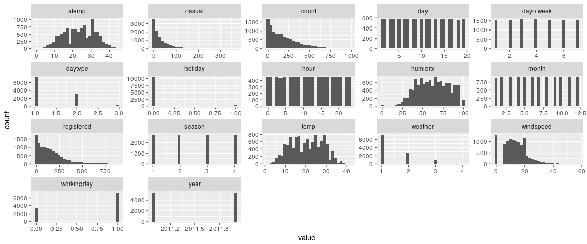

We also see nearly perfect correlation, as expected, between temp/atemp and month/season. Our registered and non-registeres demand is also highly correlated. A great many of our variables are correlated in the .25 - .5 range, and the -.25 to -.5 range.

``` r
corr_dat <- cor(bikes[,-1])
corrplot(corr_dat,type="upper", order="original", col=brewer.pal(n=8,name="RdBu"))
```


Our response (demand) appears to be bimodally distributed. We can see that a group of nonworking holidays tend to fall around a demand of 1000, and a separate group exist around 5000, suggesting there are high and low demand days. The means (shown below as dashed lines) sit between the two peaks of our density curve. 0

``` r
bydaybytype <-
  summarise(
  group_by(bikes,workingday,holiday, as.Date(datetime)),
  casual = sum(casual),
  registered = sum(registered),
  total = sum(count)
  )
colnames(bydaybytype)[3] <- "Day"
bydaybytype$type <- paste(
  ifelse(bydaybytype$workingday==1,"Working","NonWorking"),
  ifelse(bydaybytype$holiday==1,"Holday","NonHoliday")
)
ggdensity(bydaybytype,"total",color = "type",add="mean")
```

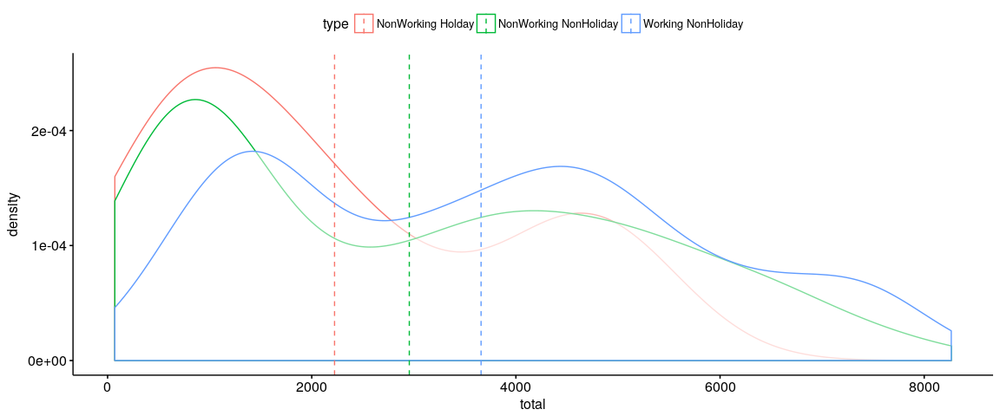

### Examining Change in Demand over Time

We have registered and non-registered rentals, leading to a total number. The data refers to non-registered people as casual renters. When we look at rentals by day, there's a pretty established time series component to demand. Demand crashed in winter and came back in spring consideribly higher than the year before. Just looking at the data it seems as if there's repeated cyclicality in the data, but also a shift year to year in demand.

``` r
byday <-
  summarise(
  group_by(bikes, as.Date(datetime)),
  casual = sum(casual),
  registered = sum(registered),
  total = sum(count)
  )
casual <- ts(byday$casual,start = min(as.Date(byday$`as.Date(datetime)`)))
registered <- ts(byday$registered,start = min(as.Date(byday$`as.Date(datetime)`)))
total <- ts(byday$total,start = min(as.Date(byday$`as.Date(datetime)`)))

dygraph(cbind(casual,registered,total))
```

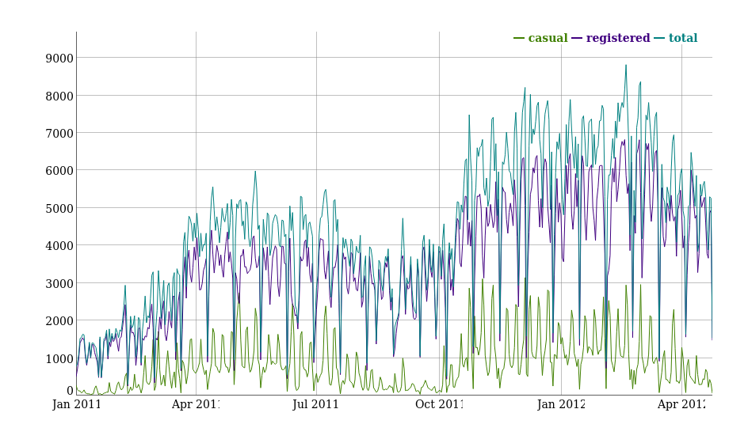

Here we can see the time components of demand broken out by casual and noncasual users. There's clear spikes by season/month, as well as hour of the day and day of the week. Demand is smooth by total day of the week because casual and non-casual users offset the demand changes they each have.

``` r
#Get our Non-Demand Variables Into Columns
m_bikes <- melt(bikes,id.vars = c("count","casual","registered"))
#Duplicate Non-Demand Features by our 3 Metrics
rem_bikes <- melt(m_bikes,id.vars=c("variable","value"))
colnames(rem_bikes) <- c("variable","value","demand_type","demand")
options(scipen=999)
rem_bikes <- subset(rem_bikes,variable %in% c("hour","day","month","year","dayofweek","season"))

ggplot(rem_bikes,aes(y=demand,x=as.numeric(value),color=demand_type)) + 
  geom_point(alpha=.025) + 
  geom_smooth(method="loess") + 
  facet_wrap(~variable,scales="free") +
  theme(legend.position="bottom")
```


### Measuring the Weather

We have temperature, the feels like temperature, humdity, and windspeed,. which seems to have clear trends. As it gets warmer, demand spikes, As it becomes more humid, demand drops, and as it rains more, demand falls off. Windspeed does not initially seems important.

``` r
bikes <- as.data.table(bikes)
m_bikes <- melt(bikes,id = "count")
m_bikes <- subset(m_bikes,variable %in% c("temp","atemp","humidity","windspeed","weather"))


ggplot(m_bikes, aes(y = count, x = value)) + 
  geom_point(alpha=.01) + 
  geom_smooth() +
  facet_wrap(~variable, scales = "free")
```

    ## `geom_smooth()` using method = 'gam' and formula 'y ~ s(x, bs = "cs")'

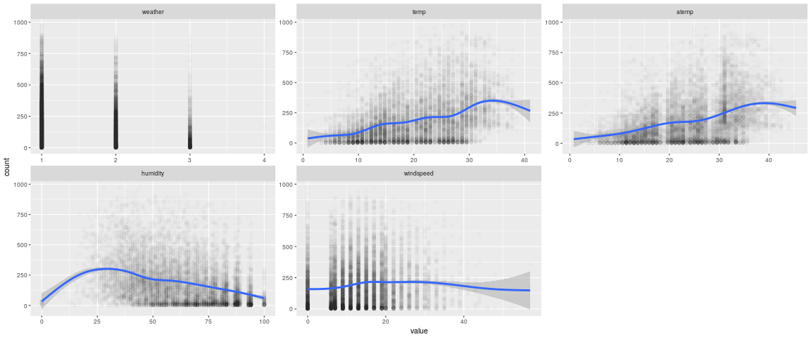

However, if interract windspeed with weather, we see that it actually does matter sometimes. When it snows, demand stays flat, but for clear skies and mist, demand decreases as windspeed increases.

``` r
bikes$weathertype <- ifelse(bikes$weather == 1,"Clear Skies",
                     ifelse(bikes$weather == 2,"Mist",
                     ifelse(bikes$weather == 3,"Snow",
                     ifelse(bikes$weather == 4,"Rain",
                            "NA"))))
ggplot(bikes,aes(y=count,x=windspeed,color=weathertype)) + geom_point(alpha=.1)  + geom_smooth()
```

    ## `geom_smooth()` using method = 'gam' and formula 'y ~ s(x, bs = "cs")'

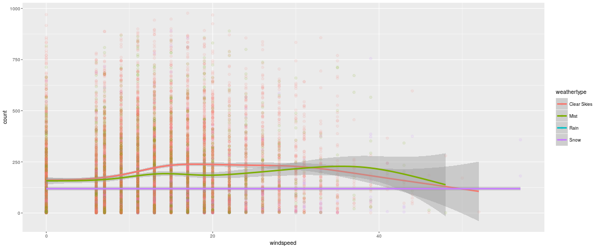

We can also see high correlation between temp and atemp, with temp being the actual temperature and atempt being the "feels like" version. There's a very odd feature of this data where atemp is between 10-15 despite temp fluctuating between 25 and 35. These readings are all from a single day 8/17/2012, and might be erroneous or the result of freak weather patterns. Humidity seems to be best predictor of atemp given temp.

``` r
ggplot(bikes,aes(y=atemp,x=temp,color=humidity)) + geom_point() + geom_abline(intercept = 0,slope=1,linetype="dashed")
```

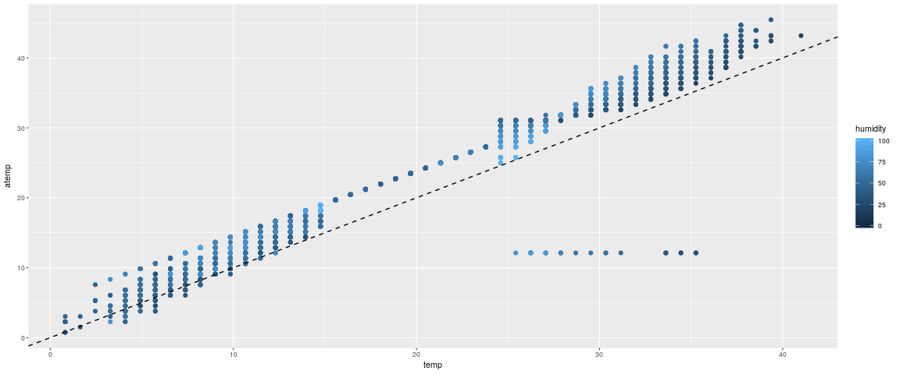

Tree Based Models
-----------------

First, we'll start with a very basic tree model. The tree ended up using five of our variable, and generated 16 terminal nodes.

``` r
RMSLEvalues=matrix(rep(0,4), ncol=1)
colnames(RMSLEvalues)<-"RMSLE values"
rownames(RMSLEvalues)<-c("Pruned tree","Tree with bagging","Refined bagging","boosting")

set.seed(1)
biketree=tree(count~holiday+workingday+weather+temp+humidity+windspeed+year+month+hour, data=bike.train)
summary(biketree)
```

    ## 
    ## Regression tree:
    ## tree(formula = count ~ holiday + workingday + weather + temp + 
    ##     humidity + windspeed + year + month + hour, data = bike.train)
    ## Variables actually used in tree construction:
    ## [1] "hour"       "temp"       "year"       "month"      "workingday"
    ## Number of terminal nodes:  16 
    ## Residual mean deviance:  9597 = 76630000 / 7984 
    ## Distribution of residuals:
    ##    Min. 1st Qu.  Median    Mean 3rd Qu.    Max. 
    ## -628.50  -50.71  -16.47    0.00   44.53  507.20

Here is a dendrogram of the tree to help visualize it.

``` r
plot(biketree)
text(biketree, pretty=0)
```

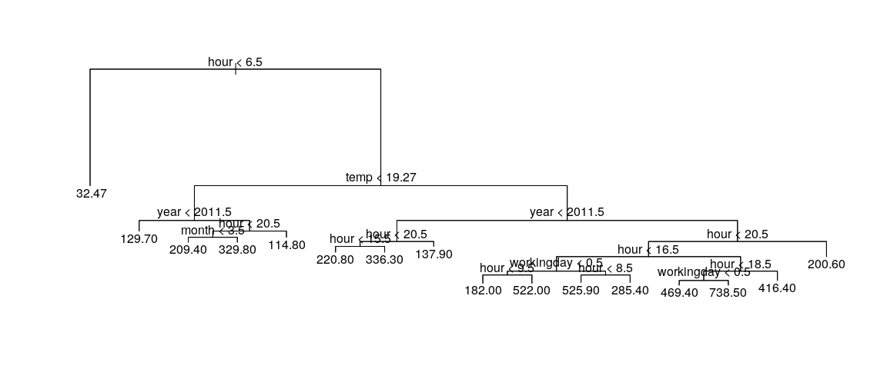

### Cross-Validating to Prune the Tree

But the tree might be overfit, so we are going to cross-validate to find the optimal tree size.

``` r
set.seed(1)
bikecv=cv.tree(biketree)
plot(bikecv$size, bikecv$dev, type="b", xlab="Terminal nodes", ylab="Deviance")
```

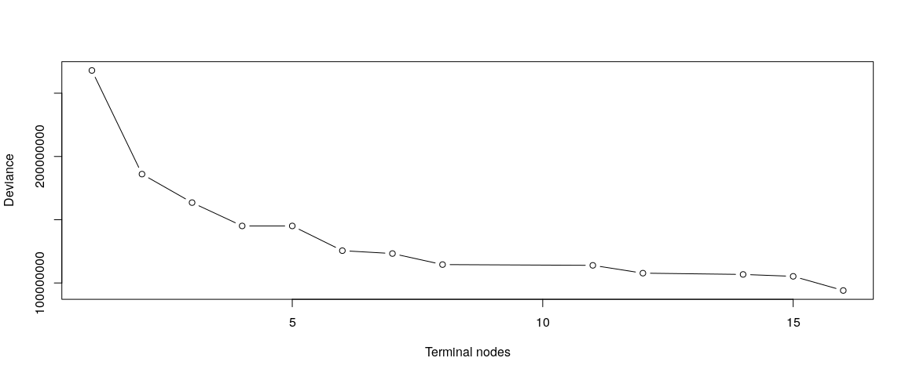

We can see that we only get marginal benefit after 8, so we prune the tree to that size.

``` r
set.seed(1)
bikeprune=prune.tree(biketree, best=8)
summary(bikeprune)
```

    ## 
    ## Regression tree:
    ## snip.tree(tree = biketree, nodes = c(122L, 14L, 13L, 60L))
    ## Variables actually used in tree construction:
    ## [1] "hour" "temp" "year"
    ## Number of terminal nodes:  8 
    ## Residual mean deviance:  13650 = 109100000 / 7992 
    ## Distribution of residuals:
    ##    Min. 1st Qu.  Median    Mean 3rd Qu.    Max. 
    ## -552.80  -68.00  -20.00    0.00   52.55  597.80

``` r
plot(bikeprune)
text(bikeprune, pretty=0)
```

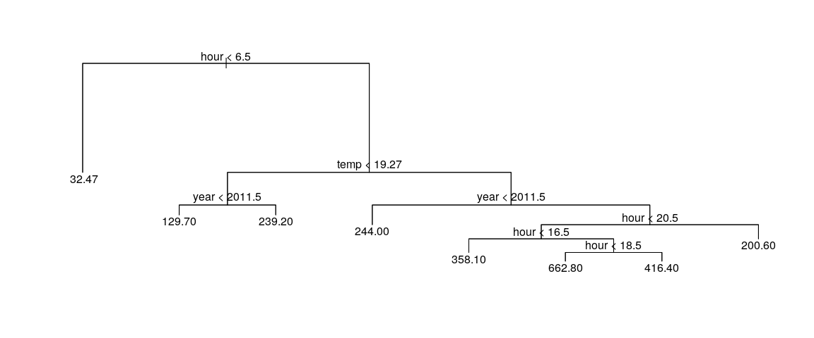

Here we can see that a basic pruned tree gets us an RMSLE of .9

``` r
results <- data.frame(Actual=bike.test$count,
                      Predicted=predict(bikeprune,newdata = bike.test))


results$Predicted[results$Predicted < 0] <- 0
RMSLE(results$Predicted,results$Actual)
```

    ## [1] 0.9058474

``` r
RMSLEvalues[1]<-RMSLE(results$Predicted,results$Actual)
```

### Decision Trees with Bagging

As an alternative to pruning the tree, we can use bootstrap aggregation, or bagging, to sample from our dataset and fit multiple trees.

``` r
set.seed(1)
bikebag=randomForest(count~holiday+workingday+weather+temp+humidity+windspeed+year+month+hour, ntree=25, mtry=9, data=bike.train, importance=TRUE)
bikebag
```

    ## 
    ## Call:
    ##  randomForest(formula = count ~ holiday + workingday + weather +      temp + humidity + windspeed + year + month + hour, data = bike.train,      ntree = 25, mtry = 9, importance = TRUE) 
    ##                Type of random forest: regression
    ##                      Number of trees: 25
    ## No. of variables tried at each split: 9
    ## 
    ##           Mean of squared residuals: 2236.128
    ##                     % Var explained: 93.27

Important Features:

``` r
varImpPlot(bikebag)
```


``` r
results <- data.frame(Actual=bike.test$count,
                      Predicted=predict(bikebag,newdata = bike.test))


results$Predicted[results$Predicted < 0] <- 0
RMSLE(results$Predicted,results$Actual)
```

    ## [1] 0.3404423

``` r
RMSLEvalues[2]<-RMSLE(results$Predicted,results$Actual)
```

### Random Forests

We can also use random foresta to generate multiple trees and then aggregate them and take a mean of their prediction. This is an alternative means of preventing overfitting to prunining and bagging. Unlike in bagging, each tree uses a random subset of all the features, so no one tree has every feature, and the aggregation allows us to tell which strong predictors considered which variables to understand variable importance.

``` r
set.seed(1)
bikerf=randomForest(count~holiday+workingday+weather+temp+humidity+windspeed+year+month+hour,data=bike.train, importance=TRUE)
bikerf
```

    ## 
    ## Call:
    ##  randomForest(formula = count ~ holiday + workingday + weather +      temp + humidity + windspeed + year + month + hour, data = bike.train,      importance = TRUE) 
    ##                Type of random forest: regression
    ##                      Number of trees: 500
    ## No. of variables tried at each split: 3
    ## 
    ##           Mean of squared residuals: 3161.216
    ##                     % Var explained: 90.49

Here we can see that hour is the most important variable.

``` r
varImpPlot(bikerf)
```

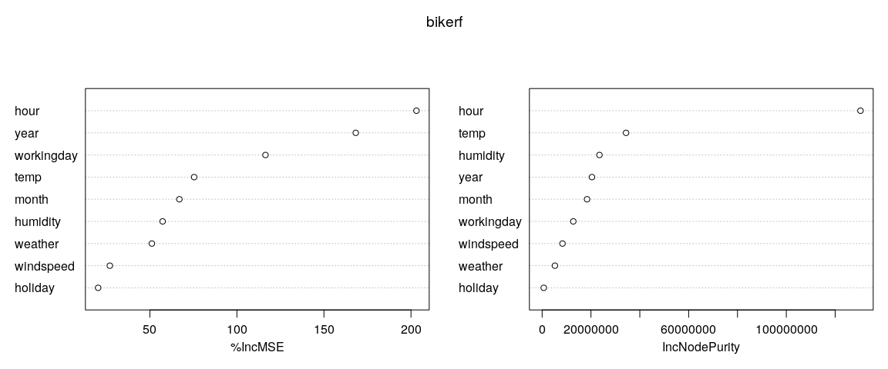

Here we can see that a random forest of trees gets us an RMSLE of .47, a considerible improvement over the pruned tree, but not as accurate as bagging.

``` r
results <- data.frame(Actual=bike.test$count,
                      Predicted=predict(bikerf,newdata = bike.test))


results$Predicted[results$Predicted < 0] <- 0
RMSLE(results$Predicted,results$Actual)
```

    ## [1] 0.4738017

``` r
RMSLEvalues[3]<-RMSLE(results$Predicted,results$Actual)
```

### eXtreme Gradient Boosted Trees

We are going to try gradient boosting via the xgboost package. Xgboost, or eXtreme gradient boosting, is an implementation of gradient boosting with regularization. Similarly to Lasso or Ridge regression, which are regularized regression, xgboost uses a loss function on the gradient boosted trees to help with overfitting.

Xgboost is a much more robust platform for gradient trees than gbm and provides additional features to peak into the model as it runs. The first step is preparing a watchlist which xgboost will use as it iterates through the creation of trees. Since gradient boosting uses weighted trees to upweight the error or previous trees, at each step we can see the additional trees impact on items of our watchlist. In our specific example, the watchlist is one training set, and one test set.

``` r
library(xgboost)
library(Matrix)

cols <-
  c(
  "season",
  "holiday",
  "workingday",
  "weather",
  "temp",
  "atemp",
  "humidity",
  "windspeed",
  "year",
  "month",
  "day",
  "hour",
  "daytype",
  "dayofweek"
  )
bike.train.xgb <- bike.train[,cols]
train_xgb <- xgb.DMatrix(data=as.matrix(bike.train.xgb),label=bike.train$count)

bike.test.xgb <- bike.test[,cols]
test_xgb <- xgb.DMatrix(data=as.matrix(bike.test.xgb),label=bike.test$count)

#Create a Watchlist and Parameter List
watchlist <- list(train=train_xgb, test=test_xgb)
```

We run the model 3 trees deep to see how this works, using arbitrary settings. At each iteration of the tree, xgboost reports to us the train and test RMSE. By watching this, we can identify the right settings, including the right number of trees.

``` r
param <- list(booster="gblinear",max_depth = 3, eta = 1)
model <- xgb.train(param, train_xgb, nrounds = 3,objective = "reg:linear", 
                 eval_metric = "rmse",watchlist=watchlist)
```

    ## [1]  train-rmse:166.895096   test-rmse:162.701385 
    ## [2]  train-rmse:159.251923   test-rmse:155.268372 
    ## [3]  train-rmse:155.265793   test-rmse:151.426117

There is also a feature called automatic stopping which will stop then the test RMSE stops getting better. Despite telling it to go for 1000 rounds it stopped early.

``` r
param <- list(max_depth = 8, eta = 1)
model <- xgb.train(param, train_xgb, nrounds = 1000,objective = "reg:linear", 
                 eval_metric = "rmse",watchlist=watchlist,early_stopping_rounds = 3)
```

    ## [1]  train-rmse:72.043961    test-rmse:77.480156 
    ## Multiple eval metrics are present. Will use test_rmse for early stopping.
    ## Will train until test_rmse hasn't improved in 3 rounds.
    ## 
    ## [2]  train-rmse:50.727863    test-rmse:62.240948 
    ## [3]  train-rmse:45.594460    test-rmse:61.411213 
    ## [4]  train-rmse:42.474327    test-rmse:59.709579 
    ## [5]  train-rmse:38.108192    test-rmse:58.191780 
    ## [6]  train-rmse:35.621120    test-rmse:58.221916 
    ## [7]  train-rmse:34.861069    test-rmse:58.362915 
    ## [8]  train-rmse:33.888287    test-rmse:58.279552 
    ## Stopping. Best iteration:
    ## [5]  train-rmse:38.108192    test-rmse:58.191780

To find the right settings to use we generate a grid search of possible logical values and fit xgboost for all of them, and then find the one that performs the best. We run each possibility through 1000 rounds with automatic stopping to find the best settings.

We then move values of max\_depth and the learning rate (eta) and see how RMSE changes.

``` r
grid = expand.grid(
eta = c(0.01,0.025,0.05,0.1,0.2,0.25,0.5),
max_depth = c(2,4,6,8,10)
)

grid.results <- c()
for (j in 1:nrow(grid)){
  tmp <- grid[j,]
  
  param <-
    list(
    max_depth = tmp$max_depth,
    eta = tmp$eta
    )
    
  model <-
    xgb.train(
    param,
    train_xgb,
    nrounds = 1000,
    objective = "reg:linear",
    eval_metric = "rmse",
    watchlist = watchlist,
    early_stopping_rounds = 3,
    verbose = 0
    )
    
  grid.results[[j]] <- model$best_score
}


grid$Test.RMSE <- grid.results
datatable(grid[order(grid$Test.RMSE,decreasing = F),],rownames = F)
```


We've now found that an eta of .1 and max\_depth of 8 lead to the lowest test RMSE. Here we can visualize the change in plots.

``` r
library(gridExtra)
p1 <- ggplot(grid,aes(y=Test.RMSE,x=max_depth)) + 
  geom_point() + 
  geom_smooth() + 
  ggtitle("Max Depth")

p2 <- ggplot(subset(grid,max_depth==8),aes(y=Test.RMSE,x=eta)) + 
  geom_point() + 
  geom_smooth() + 
  ggtitle("Eta")

grid.arrange(p1,p2)
```

    ## `geom_smooth()` using method = 'loess' and formula 'y ~ x'
    ## `geom_smooth()` using method = 'loess' and formula 'y ~ x'

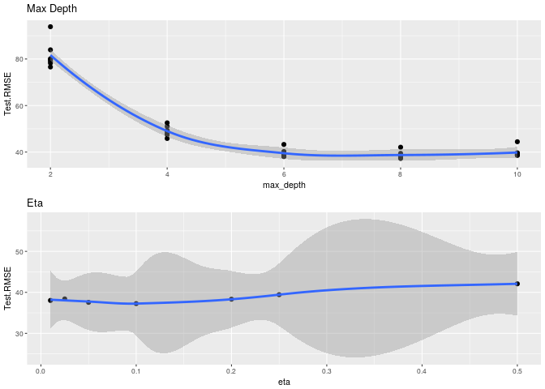

So we now refit the model with those settings. We will have it stop when the test RMSE has failed to improve for 3 rounds.

``` r
param <- list(max_depth = 8, eta = .1)
model <- xgb.train(
  param,
  train_xgb,
  nrounds = 1000,
  objective = "reg:linear",
  eval_metric = "rmse",
  watchlist = watchlist,
  early_stopping_rounds = 3,
  verbose = 0
  )
model
```

    ## ##### xgb.Booster
    ## raw: 1.9 Mb 
    ## call:
    ##   xgb.train(params = param, data = train_xgb, nrounds = 1000, watchlist = watchlist, 
    ##     verbose = 0, early_stopping_rounds = 3, objective = "reg:linear", 
    ##     eval_metric = "rmse")
    ## params (as set within xgb.train):
    ##   max_depth = "8", eta = "0.1", objective = "reg:linear", eval_metric = "rmse", silent = "1"
    ## xgb.attributes:
    ##   best_iteration, best_msg, best_ntreelimit, best_score, niter
    ## callbacks:
    ##   cb.early.stop(stopping_rounds = early_stopping_rounds, maximize = maximize, 
    ##     verbose = verbose)
    ## niter: 155
    ## best_iteration: 152
    ## best_ntreelimit: 152
    ## best_score: 37.25979

We can also generate a plot of the important features of the model. We can see that hour is the most valuable feature, with year, workingday, temp, and atemp being the 2nd most important group of features.

``` r
feat <- xgb.importance(model=model,feature_names = colnames(train_xgb))

xgb.ggplot.importance(feat)
```

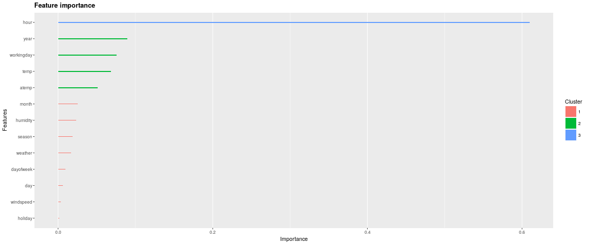

We can also generate partial dependance plots which hold variables constant and show how demand changes as that variable fluctuates. Here is an example for hour & temperature. This uses the model, now the raw data, meaning it is adjusted for the other variables.

``` r
library(pdp)

hour_pd <- partial(model,pred.var = "hour",train = bike.train.xgb)
hour_pdp <- ggplot(hour_pd,aes(y=yhat,x=hour)) + 
            geom_point() + 
            geom_line() +
            ggtitle("Change in Demand as Hour Changes")

temp_pd <- partial(model,pred.var = "temp",train = bike.train.xgb)
temp_pdp <- ggplot(temp_pd,aes(y=yhat,x=temp)) + 
            geom_point() + 
            geom_line() +
            ggtitle("Change in Demand as Temp Changes")

grid.arrange(hour_pdp,temp_pdp)
```

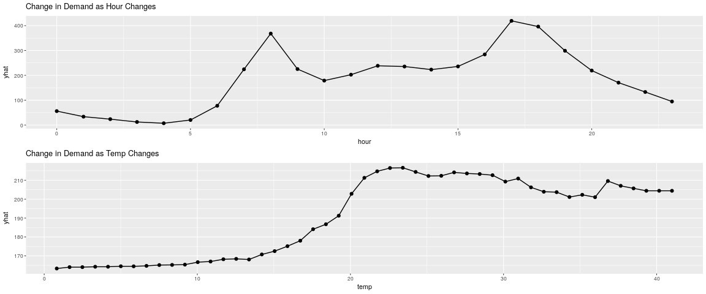

We can find the RMSLE of our model below, to gauge it against other techniques.

``` r
results <- data.frame(Actual=bike.test$count,
                      Predicted = predict(model,newdata=test_xgb))
results$Predicted[results$Predicted < 0] <- 0
RMSLE(results$Predicted,results$Actual)
```

    ## [1] 0.3957642

``` r
RMSLEvalues[4]<-RMSLE(results$Predicted,results$Actual)
```

Regression Models
=================

Besides decision tree based models, we also explore the linear and non-linear regression models for prediction. In total, five models have been evaluated:
Ridge regression; Lasso regression; Principle components regression;
Partial least squares regression;
Generalized additive models (GAM) with several submodels:
- Using natural splines for continuous variables; - Using smoothing splines for continuous variables;
- Using local regression considering the interactions between "temp" and "humidity", or between "windspeed" and "humidity".

When evaluating the regression models, we include the cross validation by splitting the training dataset into two parts: using seed 1 to randomly sample 8000 observations as the train set, while the rest of the observations in the training dataset serve as the test set. Root Mean Squared Logarithmic Error (RMSLE) is calculated against the test set to evaluate the prediction performance of the models.

Linear regression models
------------------------

Before starting with the regression models, we firstly convert the categorical variables into factors.

The general principle and procedure for the ridge/lasso regression with cross validation is:
1) Split the dataset into 2 parts, one as the test dataset, the other as the training dataset;
2) Use the training dataset to find the optimal model. Specifically, use the cv.glmnet function in the R package “glmnet” to perform 10-fold cross validation within the training dataset, using ridge regression with alpha=0 or lasso regression with alpha=1. The cross validation check through a grid of a hundred lambda values ranging from 1e(-2) to 1e(10). The best model having the smallest cross-validation error is selected as the model with the optimal lambda.
3) Calculate the Root Mean Squared Logarithmic Error (RMSLE) using the optimal lambda value and the test dataset to determine the performance of the selected best model.

``` r
RMSLEvalues.r=matrix(rep(0,8), ncol=1)
colnames(RMSLEvalues.r)<-"RMSLE values"
rownames(RMSLEvalues.r)<-c("GAM_natural splines","GAM_smoothing splines","GAM_local_temp humidity","GAM_local_windspeed humidity","Ridge regression", "Lasso regression","Principal components regression","Partial least squares")

# Ridge regression
bike1<-bikes
bike1$weather<-as.factor(bike1$weather)
bike1$year<-as.factor(bike1$year)
bike1$month<-as.factor(bike1$month)
bike1$dayofweek<-as.factor(bike1$dayofweek)
bike1$daytype<-as.factor(bike1$daytype)
bike1$hour<-as.factor(bike1$hour)

# Create a training set containing a random sample of 8000 observations, 
# and a test set containing the remaining observations.
set.seed (1)
train=sample (1: nrow(bike1), 8000)
bike1.train=bike1[train,]
bike1.test=bike1[-train,]

x=model.matrix(count~.,bike1.train[,c("weather","temp","atemp","humidity","windspeed","count","year","month","hour","dayofweek","daytype")])[,-1]
x.t=model.matrix(count~.,bike1.test[,c("weather","temp","atemp","humidity","windspeed","count","year","month","hour","dayofweek","daytype")])[,-1]
y=bike1.train$count
y.t=bike1.test$count
grid=10^seq (10,-2, length=100)

ridge.mod=glmnet(x, y, alpha=0,lambda=grid)
# par(mfrow=c(1,1))
# plot(ridge.mod)
set.seed(1)
cv.out=cv.glmnet(x, y,alpha=0, lambda=grid)
# plot(cv.out)
bestlam=cv.out$lambda.min
out=glmnet(x, y, alpha=0, lambda=grid)
ridge.coef=predict(out, type="coefficients", s=bestlam)[1:10,]
ridge.coef
ridge.coef[ridge.coef!=0]

mse.reg=matrix (rep(0,8), ncol=2)
colnames(mse.reg)<-c("train","test")
rownames(mse.reg)<-c("Ridge","Lasso","Pricipal components","Least square")

ridge.pred=predict(ridge.mod, s=bestlam, newx=x)
mse.reg[1,1]=mean((ridge.pred-y)^2)
ridge.pred=predict(ridge.mod, s=bestlam, newx=x.t)
mse.reg[1,2]=mean((ridge.pred-y.t)^2)

tree_results<- data.frame(Actual=y.t,Predicted=predict(ridge.mod, s=bestlam, newx=x.t))
colnames(tree_results)<-c("Actual","Predicted")
tree_results$Predicted[tree_results$Predicted < 0] <- 0
RMSLEvalues.r[5]=RMSLE(tree_results$Predicted,tree_results$Actual)

# Lasso regression
lasso.mod=glmnet(x, y, alpha=1,lambda=grid)
# par(mfrow=c(1,1))
# plot(lasso.mod)
set.seed(1)
cv.out=cv.glmnet(x, y,alpha=1,lambda=grid)
# plot(cv.out)
bestlam=cv.out$lambda.min
out=glmnet(x, y, alpha=1, lambda=grid)
lasso.coef=predict(out, type="coefficients", s=bestlam)
lasso.coef
# lasso.coef[lasso.coef!=0]

lasso.pred=predict(lasso.mod, s=bestlam, newx=x)
mse.reg[2,1]=mean((lasso.pred-y)^2)
lasso.pred=predict(lasso.mod, s=bestlam, newx=x.t)
mse.reg[2,2]=mean((ridge.pred-y.t)^2)

tree_results<- data.frame(Actual=y.t,Predicted=predict(lasso.mod, s=bestlam, newx=x.t))
colnames(tree_results)<-c("Actual","Predicted")
tree_results$Predicted[tree_results$Predicted < 0] <- 0
RMSLEvalues.r[6]=RMSLE(tree_results$Predicted,tree_results$Actual)
```

In comparison, we also tested the principal components regression and partial least squares models.

The general principle and procedure for the principle components regression or partial least squares models with cross validation is:
1) Split the 25 observations into 2 parts, one as the test dataset, the other as the training dataset;
2) Use the training dataset to find the optimal model. Specifically, use the pcr function in the R package “pls” to perform 10-fold cross validation with principal components regression (validation = “CV”). Or, use the pls function in the R package “pls” to perform 10-fold cross validation with principal components regression (validation = “CV”). The model with minimized adjusted cross-validation error is selected. The corresponding number of components is recorded (48 for pcr model, and 18 for pls model in this case);
3) Calculate the Root Mean Squared Logarithmic Error (RMSLE) using the best model with the optimal number of components against the test dataset to evaluate the model performance.

``` r
# Principal components regression
set.seed(1)
pcr.fit=pcr(y~x, validation="CV")
summary(pcr.fit)
# validationplot(pcr.fit, val.type="MSEP")
pcr.fit=pcr(y~x, ncomp=48)
summary(pcr.fit)

pcr.pred=predict(pcr.fit, x, ncomp=48)
mse.reg[3,1]=mean((pcr.pred-y)^2)
pcr.pred=predict(pcr.fit, x.t, ncomp=48)
mse.reg[3,2]=mean((pcr.pred-y.t)^2)

tree_results<- data.frame(Actual=y.t,Predicted=predict(pcr.fit, x.t, ncomp=48))
colnames(tree_results)<-c("Actual","Predicted")
tree_results$Predicted[tree_results$Predicted < 0] <- 0
RMSLEvalues.r[7]=RMSLE(tree_results$Predicted,tree_results$Actual)

# Partial least square regression
set.seed(1)
pls.fit=plsr(y~x,validation="CV")
summary(pls.fit)
# validationplot(pls.fit, val.type="MSEP")
pls.fit=plsr(y~x,ncomp=18)
summary(pls.fit)

pls.pred=predict (pls.fit, x, ncomp=18)
mse.reg[4,1]=mean((pls.pred-y)^2)
pls.pred=predict (pls.fit, x.t, ncomp=18)
mse.reg[4,2]=mean((pls.pred-y.t)^2)

mse.reg

tree_results<- data.frame(Actual=y.t,Predicted=predict(pls.fit, x.t,ncomp=18))
colnames(tree_results)<-c("Actual","Predicted")
tree_results$Predicted[tree_results$Predicted < 0] <- 0
RMSLEvalues.r[8]=RMSLE(tree_results$Predicted,tree_results$Actual)
```

Non-linear regression models
----------------------------

To explore non-linear regression, we apply generalize additive models (GAM). Four types of models are evaluated using respectively four non-linear regression processing for the continuous variables: natural splines, smoothing splines, local regression with interaction between temp and humidity, and local regression with interaction between windspeed and humidity. ANOVA is used to evaluate the significance of difference among the same type of model but with stepwise addition of prediction variables. Thus ANOVA help to select and keep significant variables for model optimization.

``` r
# GAM

# Natural splines
bikes$daytype<-ifelse(bikes$holiday<bikes$workingday,1,
                     ifelse(bikes$holiday==bikes$workingday,2,3))

gam1=lm(count~ns(temp,5)+ns(humidity,5)+ns(windspeed,3),data=bikes)
gam2=lm(count~ns(temp,5)+ns(humidity,5)+ns(windspeed,3)+ns(atemp,5),data=bikes)
gam3=lm(count~ns(temp,5)+ns(humidity,5)+ns(windspeed,3)+ns(atemp,5)+ 
          as.factor(daytype),data=bikes)
gam4=lm(count~ns(temp,5)+ns(humidity,5)+ns(windspeed,3)+ns(atemp,5)+ 
          as.factor(daytype)+as.factor(month),data=bikes)
gam5=lm(count~ns(temp,5)+ns(humidity,5)+ns(windspeed,3)+ns(atemp,5)+ 
          as.factor(daytype)+ as.factor(month)+as.factor(weather),data=bikes)
gam6=lm(count~ns(temp,5)+ns(humidity,5)+ns(windspeed,3)+ns(atemp,5)+ 
        as.factor(daytype)+as.factor(month)+as.factor(year)+as.factor(weather),
        data=bikes)
gam7=lm(count~ns(temp,5)+ns(humidity,5)+ns(windspeed,3)+ns(atemp,5) + 
        as.factor(daytype)+ as.factor(month)+as.factor(year)+as.factor(weather)+
        as.factor(hour), data=bikes)
gam8.1=lm(count~ns(temp,5)+ns(humidity,5)+ns(windspeed,3)+ns(atemp,5)+ 
            as.factor(daytype)+ as.factor(month)+as.factor(year)+as.factor(weather)+
            as.factor(hour)+as.factor(dayofweek),data=bikes)
anova(gam1, gam2, gam3, gam4, gam5, gam6, gam7, gam8.1, test="F")

# Remove daytype
gam1=lm(count~ns(temp,5)+ns(humidity,5)+ns(windspeed,3),data=bikes)
gam2=lm(count~ns(temp,5)+ns(humidity,5)+ns(windspeed,3)+ns(atemp,5),data=bikes)
gam3=lm(count~ns(temp,5)+ns(humidity,5)+ns(windspeed,3)+ns(atemp,5)+ 
          as.factor(month),data=bikes)
gam4=lm(count~ns(temp,5)+ns(humidity,5)+ns(windspeed,3)+ns(atemp,5)+ 
          as.factor(month)+as.factor(weather),data=bikes)
gam5=lm(count~ns(temp,5)+ns(humidity,5)+ns(windspeed,3)+ns(atemp,5)+ 
          as.factor(month)+ as.factor(weather)+as.factor(year),data=bikes)
gam6=lm(count~ns(temp,5)+ns(humidity,5)+ns(windspeed,3)+ns(atemp,5)+ 
          as.factor(month)+as.factor(weather)+as.factor(year)+as.factor(hour),
        data=bikes)
gam7.2=lm(count~ns(temp,5)+ns(humidity,5)+ns(windspeed,3)+ns(atemp,5)+ 
            as.factor(month)+ as.factor(weather)+as.factor(year)+as.factor(hour)+
            as.factor(dayofweek),data=bikes)
anova(gam1, gam2, gam3, gam4, gam5, gam6, gam7.2, test="F")

# par(mfrow=c(2,5))
# plot.Gam(gam7.2, se=TRUE , col ="red")

# Smoothing splines
gam1=lm(count~s(temp,5)+s(humidity,5)+s(windspeed,3),data=bikes)
gam2=lm(count~s(temp,5)+s(humidity,5)+s(windspeed,3)+s(atemp,5),data=bikes)
gam3=lm(count~s(temp,5)+s(humidity,5)+s(windspeed,3)+s(atemp,5)+ 
          as.factor(month),data=bikes)
gam4=lm(count~s(temp,5)+s(humidity,5)+s(windspeed,3)+s(atemp,5)+ as.factor(month)+
          as.factor(weather),data=bikes)
gam5=lm(count~s(temp,5)+s(humidity,5)+s(windspeed,3)+s(atemp,5)+ as.factor(month)+
          as.factor(weather)+as.factor(year),data=bikes)
gam6=lm(count~s(temp,5)+s(humidity,5)+s(windspeed,3)+s(atemp,5)+ as.factor(month)+
          as.factor(weather)+as.factor(year)+as.factor(hour),
        data=bikes)
gam7.3=lm(count~s(temp,5)+s(humidity,5)+s(windspeed,3)+s(atemp,5)+ as.factor(month)+
          as.factor(weather)+as.factor(year)+as.factor(hour)+as.factor(dayofweek),
        data=bikes)
anova(gam1, gam2, gam3, gam4, gam5, gam6, gam7.3, test="F")

# par(mfrow=c(2,5))
# plot.Gam(gam7.3, se=TRUE , col ="blue")

# par(mfrow=c(1,1))
# plot(count~temp,data=bikes)
# abline(lm(count~temp,data=bikes),col="green")
# abline(lm(count~atemp,data=bikes),col="blue")
# abline(lm(count~humidity,data=bikes),col="red")
# abline(lm(count~windspeed,data=bikes),col="purple")

test<-lm(count~temp+atemp+temp*atemp, data=bikes)
test1<-lm(count~temp+humidity+temp*humidity, data=bikes)
test2<-lm(count~temp+windspeed+temp*windspeed, data=bikes)
test3<-lm(count~humidity+windspeed+humidity*windspeed, data=bikes)

# Local regression with interactions
gam1=lm(count~lo(temp, humidity, span=0.5)+ns(windspeed,3),data=bikes)
gam2=lm(count~lo(temp, humidity, span=0.5)+ns(windspeed,3)+ns(atemp,5),data=bikes)
gam3=lm(count~lo(temp, humidity, span=0.5)+ns(windspeed,3)+ns(atemp,5)+ 
          as.factor(month),data=bikes)
gam4=lm(count~lo(temp, humidity, span=0.5)+ns(windspeed,3)+ns(atemp,5)+ 
          as.factor(month)+as.factor(weather),data=bikes)
gam5=lm(count~lo(temp, humidity, span=0.5)+ns(windspeed,3)+ns(atemp,5)+ 
          as.factor(month)+as.factor(weather)+as.factor(year),data=bikes)
gam6=lm(count~lo(temp, humidity, span=0.5)+ns(windspeed,3)+ns(atemp,5)+ 
          as.factor(month)+as.factor(weather)+as.factor(year)+as.factor(hour),
        data=bikes)
gam7.4=lm(count~lo(temp, humidity, span=0.5)+ns(windspeed,3)+ns(atemp,5)+ 
            as.factor(month)+as.factor(weather)+as.factor(year)+as.factor(hour)+
            as.factor(dayofweek),data=bikes)
anova(gam1, gam2, gam3, gam4, gam5, gam6, gam7.4, test="F")

# par(mfrow=c(2,5))
# plot.Gam(gam7.4, se=TRUE , col ="green")

gam1=lm(count~lo(humidity, windspeed, span=0.5)+ns(temp,5),data=bikes)
gam2=lm(count~lo(humidity, windspeed, span=0.5)+ns(temp,5)+ns(atemp,5),data=bikes)
gam3=lm(count~lo(humidity, windspeed, span=0.5)+ns(temp,5)+ns(atemp,5)+ 
          as.factor(month),data=bikes)
gam4=lm(count~lo(humidity, windspeed, span=0.5)+ns(temp,5)+ns(atemp,5)+ 
          as.factor(month)+as.factor(weather),data=bikes)
gam5=lm(count~lo(humidity, windspeed, span=0.5)+ns(temp,5)+ns(atemp,5)+ 
          as.factor(month)+ as.factor(weather)+as.factor(year),data=bikes)
gam6=lm(count~lo(humidity, windspeed, span=0.5)+ns(temp,5)+ns(atemp,5)+ 
          as.factor(month)+ as.factor(weather)+as.factor(year)+as.factor(hour),
        data=bikes)
gam7.5=lm(count~lo(humidity, windspeed, span=0.5)+ns(temp,5)+ns(atemp,5)+ 
            as.factor(month)+as.factor(weather)+as.factor(year)+as.factor(hour)+
            as.factor(dayofweek),data=bikes)
anova(gam1, gam2, gam3, gam4, gam5, gam6, gam7.5, test="F")

# par(mfrow=c(2,5))
# plot.Gam(gam7.5, se=TRUE , col ="purple")

# Create a training set containing a random sample of 2500 observations, 
# and a test set containing the remaining observations.
set.seed (1)
train=sample (1: nrow(bikes), 8000)
bike.train=bikes[train,]
bike.test=bikes[-train,]
# if(sum(bike.test$weather==4)>0){bike.test<-bike.test[bike.test$weather!=4,]}

# Comparing the models
gam7.2=lm(count~ns(temp,5)+ns(humidity,5)+ns(windspeed,3)+ns(atemp,5)+
            as.factor(month)+ as.factor(weather)+as.factor(year)+as.factor(hour)+
            as.factor(dayofweek),data=bike.train)
gam7.3=lm(count~s(temp,5)+s(humidity,5)+s(windspeed,3)+ns(atemp,5)+ as.factor(month)+
            as.factor(weather)+as.factor(year)+as.factor(hour)+as.factor(dayofweek),
          data=bike.train)
gam7.4=lm(count~lo(temp, humidity, span=0.5)+ns(windspeed,3)+ns(atemp,5)+ 
            as.factor(month)+ as.factor(weather)+as.factor(year)+as.factor(hour)+
            as.factor(dayofweek), data=bike.train)
gam7.5=lm(count~lo(humidity, windspeed, span=0.5)+ns(temp,5)+ns(atemp,5)+ 
            as.factor(month)+ as.factor(weather)+as.factor(year)+as.factor(hour)+
            as.factor(dayofweek), data=bike.train)

mse=matrix (rep(0,8), ncol=2)
colnames(mse)<-c("train","test")
rownames(mse)<-c("ns","s","lo1","lo2")

preds=predict(gam7.2,newdata=bike.train)
mse[1,1]=mean((preds-bike.train$count)^2)
preds=predict(gam7.2,newdata=bike.test)
mse[1,2]=mean((preds-bike.test$count)^2)

preds=predict(gam7.3,newdata=bike.train)
mse[2,1]=mean((preds-bike.train$count)^2)
preds=predict(gam7.3,newdata=bike.test)
mse[2,2]=mean((preds-bike.test$count)^2)

preds=predict(gam7.4,newdata=bike.train)
mse[3,1]=mean((preds-bike.train$count)^2)
preds=predict(gam7.4,newdata=bike.test)
mse[3,2]=mean((preds-bike.test$count)^2)

preds=predict(gam7.5,newdata=bike.train)
mse[4,1]=mean((preds-bike.train$count)^2)
preds=predict(gam7.5,newdata=bike.test)
mse[4,2]=mean((preds-bike.test$count)^2)

mse

tree_results<- data.frame(Actual=bike.test$count,Predicted=predict(gam7.2,bike.test))
tree_results$Predicted[tree_results$Predicted < 0] <- 0
RMSLEvalues.r[1]=RMSLE(tree_results$Predicted,tree_results$Actual)

tree_results<- data.frame(Actual=bike.test$count,Predicted=predict(gam7.3,bike.test))
tree_results$Predicted[tree_results$Predicted < 0] <- 0
RMSLEvalues.r[2]=RMSLE(tree_results$Predicted,tree_results$Actual)

tree_results<- data.frame(Actual=bike.test$count,Predicted=predict(gam7.4,bike.test))
tree_results$Predicted[tree_results$Predicted < 0] <- 0
RMSLEvalues.r[3]=RMSLE(tree_results$Predicted,tree_results$Actual)

tree_results<- data.frame(Actual=bike.test$count,Predicted=predict(gam7.5,bike.test))
tree_results$Predicted[tree_results$Predicted < 0] <- 0
RMSLEvalues.r[4]=RMSLE(tree_results$Predicted,tree_results$Actual)


RMSLEvalues.r
```

The RMSLE values for the eight regression based models are as follows. The lasso regression model obtains the lowest RMSLE, thus is the best model among the eight regression based models.

``` r
RMSLEvalues.r
```

    ##                                 RMSLE values
    ## GAM_natural splines                 1.170754
    ## GAM_smoothing splines               1.164875
    ## GAM_local_temp humidity             1.162749
    ## GAM_local_windspeed humidity        1.163184
    ## Ridge regression                    1.142632
    ## Lasso regression                    1.141806
    ## Principal components regression     1.143275
    ## Partial least squares               1.147187

Model comparison
================

Overall, the RMSLE values of all the models evaluated in this report are as follows:

``` r
RMSLEvalues.df<-as.data.frame(RMSLEvalues)
RMSLEvalues.r.df<-as.data.frame(RMSLEvalues.r)
results<-full_join(RMSLEvalues.df,RMSLEvalues.r.df)
```

    ## Joining, by = "RMSLE values"

``` r
rownames(results)<-c(rownames(RMSLEvalues.df),rownames(RMSLEvalues.r.df))
results
```

    ##                                 RMSLE values
    ## Pruned tree                        0.9058474
    ## Tree with bagging                  0.3404423
    ## Refined bagging                    0.4738017
    ## boosting                           0.3957642
    ## GAM_natural splines                1.1707542
    ## GAM_smoothing splines              1.1648751
    ## GAM_local_temp humidity            1.1627495
    ## GAM_local_windspeed humidity       1.1631838
    ## Ridge regression                   1.1426316
    ## Lasso regression                   1.1418055
    ## Principal components regression    1.1432751
    ## Partial least squares              1.1471867

The decision tree based models obtain lower RMSLE than the regression based models. We think the reason is due to the complexity of the relationship between "count" and the predictors in the dataset. Decision tree based methods are more flexible, with less constraints in the model compared with regression models such as following regression "lines". Therefore classification methods can handle more complicated data structures. Specifically, the random forest with bagging model perform the best in cross-validation.

Conclusions
===========

We developed models to predict the total bike renting count by hour, using the data provided by the "Bike Sharing Demand" from Kaggle. We have evaluated four decision tree based models and eight regression based models. Overall, the tree based models perform better with lower Root Mean Squared Logarithmic Error (RMSLE) values compared with regression models. Specifically, the random forest with bagging model perform the best in cross validation, followed by the eXtreme Gradient Boosted Tree model.

We submitted to kaggle and simulated the score we would have received had we participated in this competition when it was actively running. Our bagging model had a score of .50425, vs our boosting model .52060, meaning our model performed slightly better on our own test set than the kaggle test set. The most logical reason for this is that the kaggle test set is split in time, whereas we used a random sample from within our data.

``` r
test <- read.csv("test.csv")
test$datetime <- as.POSIXct(test$datetime)
test$year <- year(test$datetime)
test$month <- month(test$datetime)
test$day <- day(test$datetime)
test$hour <- hour(test$datetime)
test$dayofweek <- as.numeric(as.factor(weekdays(test$datetime)))
test$daytype<-ifelse(test$holiday<test$workingday,1,
                     ifelse(test$holiday==test$workingday,2,3))


#Bagging
bag_kaggle <- test
bag_kaggle$count <- predict(bikebag,newdata=test)
bag_kaggle <- bag_kaggle[,c("datetime","count")]

#xgboost
cols <-
  c(
  "season",
  "holiday",
  "workingday",
  "weather",
  "temp",
  "atemp",
  "humidity",
  "windspeed",
  "year",
  "month",
  "day",
  "hour",
  "daytype",
  "dayofweek"
  )
kaggle.boost <- test[,cols]
kaggle_xgb <- xgb.DMatrix(data=as.matrix(kaggle.boost))
boost_kaggle <- test
boost_kaggle$count <- predict(model,newdata = kaggle_xgb)
boost_kaggle <- boost_kaggle[,c("datetime","count")]
boost_kaggle$count[boost_kaggle$count < 0] <- 0

write.csv(x = bag_kaggle,"baggingsubmit.csv",row.names = F)
write.csv(x = boost_kaggle,"boostingsubmit.csv",row.names = F)
```
